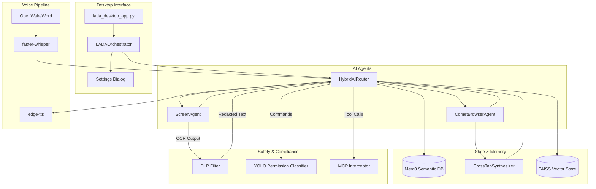

# LADA v12.0 System Architecture

The v12.0 rewrite transitioned LADA from a monolithic desktop utility to an asynchronous, multi-agent AI system with distinct, independent subsystems. 

## Key Subsystems

### 1. CometBrowserAgent + CrossTabSynthesizer
Uses the Playwright async API to manage multiple tabs concurrently. The `CrossTabSynthesizer` captures semantic snapshots of each tab to provide the AI with multi-page reasoning capabilities.

### 2. Mem0 Semantic Memory
Injected into the `HybridAIRouter`, it stores conversations and preferences over time, supplementing the existing FAISS RAG store.

### 3. Voice Pipeline Router
A sub-second latency voice I/O pipeline using `openwakeword` for wake-word detection, `faster-whisper` for STT, and `edge-tts` for high-quality text-to-speech.

### 4. Safety Guardrails (DLP, YOLO, MCP)
Three distinct security layers:
- **DLP**: Prevents sensitive data from reaching the cloud.
- **YOLO**: Classifies commands into SAFE, CONFIRM, and DENY tiers.
- **MCP Interceptor**: Rate-limits and audits external tool calls.
